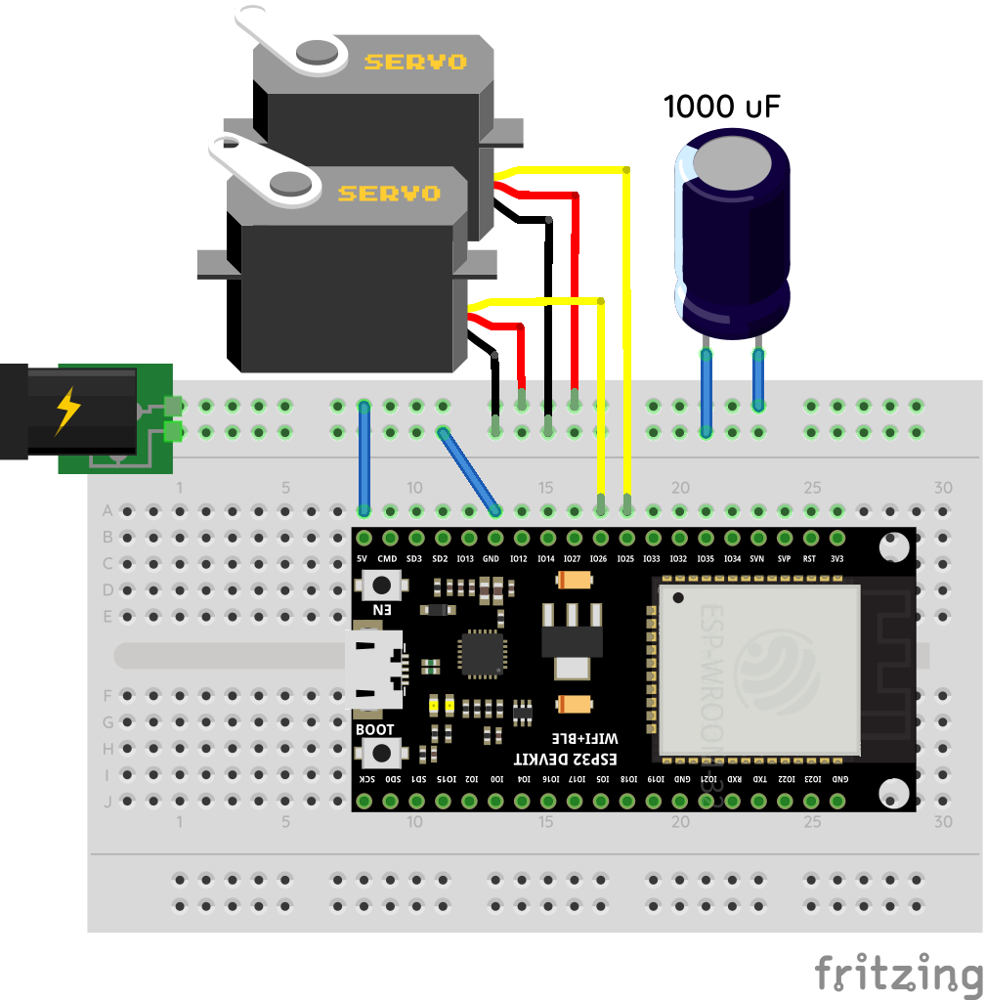

# wheels

Two silicone wheels you can stick things between.

# How to build

## Parts

- ESP-32 dev board (the diagram shows the 38-pin variant, but the 30-pin variant should also work if
  you change the wiring accordingly)
- two high-torque (> 10 kgf·cm) analog continuous rotation servos (I used Feetech FS5113R)
- two servo discs compatible with your servos, with 4x `M3` mounting holes and a mounting hole
  spacing of `14 mm` (or change the `screw_holes`, `screw_hole_r` and `screw_hole_offset` parameters
  in `wheel.scad` to match whatever you have)
- low-impedance `1000 uF` capacitor
- 5V power adapter with enough max current to power the servos and the ESP. Multiply the stall
  current of your servo by two, and add `1 A`. That's how many amps you will need. For my FS5113R
  servos, I needed a `4 A` supply.
- power plug for the adapter
- 1x [`frame.stl`]
- 1x [`vessel.stl`] (might need two if it breaks during unmolding)
- 2x [`ring.stl`]
- 2x [`wheel.stl`]
- 2x [`mold.stl`]
- at least `200 ml` of skin-safe silicone casting gel with a hardness of `00-20` or softer (I used
  Ecoflex 00-20)
- duct tape
- two zip ties
- breadboard and M-M jumper wires

## Wheels

Put a `wheel.stl`, two `mold.stl`s and two `ring.stl`s into a `vessel.stl` (one ring goes to the
bottom, one to the top at the end, the rest will only fit one way). Make sure to grease every
surface with vaseline beforehand **except** `wheel.stl` and the outside of `vessel.stl`.

Secure everything into `vessel.stl` by wrapping a strip of duct tape around it.

Prepare `100 ml` of the silicone and fill `vessel.stl` to the brim. Pour it slowly in a thin stream
to avoid bubbles. Carefully unmold when ready. You should end up with a silicone tire around
`wheel.stl`. Repeat for the other wheel. You can reuse every part except `wheel.stl`.

Screw the servo discs onto the **outer side** of each wheel. The screws go in from the inside of the
wheel.

## Circuit



You might have to solder the power plug to some jumper wires. In that case, mind the polarity.
Center pin is usually the live one, but definitely test with a multimeter before connecting.

## Firmware

Upload [`firmware.ino`] to the ESP-32 using the Arduino IDE. You'll need to install the ESP-32
standard libraries and the `ESP32Servo` library.

While flashing the firmware, you might need to hold the `BOOT` button on the ESP-32.

## Final Assembly

Put the two servos in `frame.stl`. Secure each with a zip tie (the grooves on the frame are for
holding the zip ties).

Screw each wheel on a servo through the servo disc.

Finally, connect each servo to the circuit. Mind the wiring (usually, brown = GND, red = 5V, orange
= pulse).

# How to use

The device boots up when you connect it to the power supply, like the Handy. You'll need to pair it
with your PC via Bluetooth to use it.

The `bridge.exe` program connects the device to Intiface via WSDM. Right now this only works with
[Intiface Engine]; you'll get weird connection drops if you try it with Intiface Central.

Copy `buttplug-user-device-config.json` into the directory where `intiface-engine.exe` is, then `cd`
into the same directory and run:

```
.\intiface-engine.exe --websocket-port 12345 --use-device-websocket-server --user-device-config-file .\buttplug-user-device-config.json
```

With both `intiface-engine` and `bridge` running, the device should now appear in Intiface clients
as two Synchro devices, each corresponding to a wheel. If you're using LoveMachine, you can assign a
different body part to each wheel and simulate some pretty complex movements.

Longer term we would probably want to emulate a two-rotator device like a UFO Tw and bypass WSDM
entirely, but LoveMachine can't control device features independently yet, so this setup is more
featureful for the time being.

Based on personal tests, I recommend a thick lube with lots of humectant so it won't dry out that
fast.

You can adjust the clearance between the wheels through the `spacing` parameter in `frame.stl`. In
future releases I should try to make this mechanically adjustable or spring loaded so that you won't
have to waste plastic trying to find the ideal size.

# How to clean

Unscrew the wheels from the servos before cleaning. Clean with warm or lukewarm water and soap.
Drying should be easy since every surface is exposed to air. Do not attach them to the device until
completely dry.

[`frame.stl`]: https://github.com/Sauceke/wheels/releases/latest/download/frame.stl
[`vessel.stl`]: https://github.com/Sauceke/wheels/releases/latest/download/vessel.stl
[`ring.stl`]: https://github.com/Sauceke/wheels/releases/latest/download/ring.stl
[`wheel.stl`]: https://github.com/Sauceke/wheels/releases/latest/download/wheel.stl
[`mold.stl`]: https://github.com/Sauceke/wheels/releases/latest/download/mold.stl
[`firmware.ino`]: https://github.com/Sauceke/wheels/releases/latest/download/firmware.ino
[`buttplug-user-device-config.json`]:
  https://github.com/Sauceke/wheels/releases/latest/download/buttplug-user-device-config.json
[Intiface Engine]: https://github.com/intiface/intiface-engine/releases
